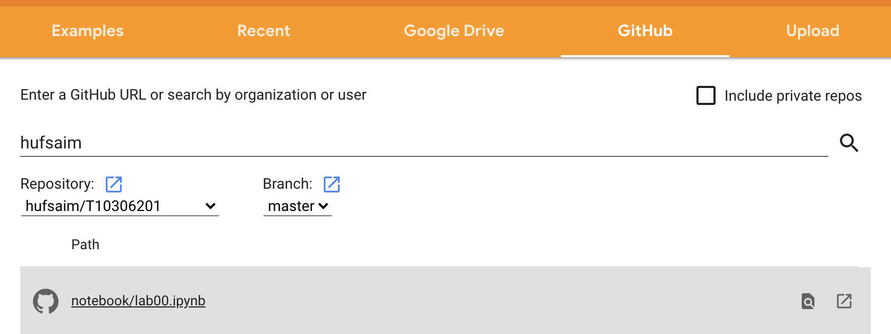

## T10306201
# 의료영상처리의 이론 및 실습
한국외국어대학교 바이오메디컬공학부 의료영상처리의 이론 및 실습 수업을 위한 페이지입니다. 

### 담당교수
- 남윤호 (Yoonho Nam)
- 공학관(용인) 408-5호
- yoonhonam@hufs.ac.kr
- office hours: 

### 교재 및 참고문헌
- "Digital Image Processing, 4th Edition", by Rafael C. Gonzalez and Richard E. Woods. Pearson.
- "Deep Learning with PyTorch", Eli Stevens, Luca Antiga, and Thomas Viehmann. Manning.

### Google Colab을 이용한 실습
- Google colab.을 이용하면 실습코드를 불러와서 바로 실습을 진행할 수 있습니다.

- [https://colab.research.google.com/github/](https://colab.research.google.com/github/)

- hufsaim으로 검색 후, hufsaim/T10306201을 선택하면 업로드된 실습파일들을 확인할 수 있습니다.

- Chrome browser를 사용하는 것을 권장합니다.
